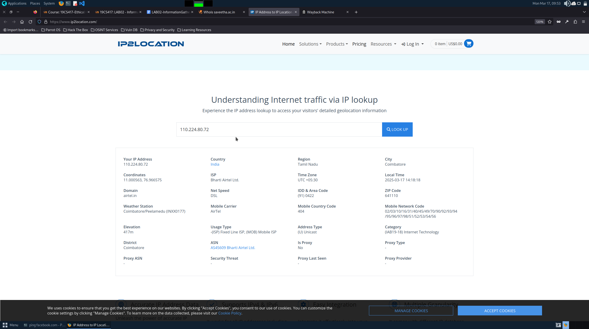
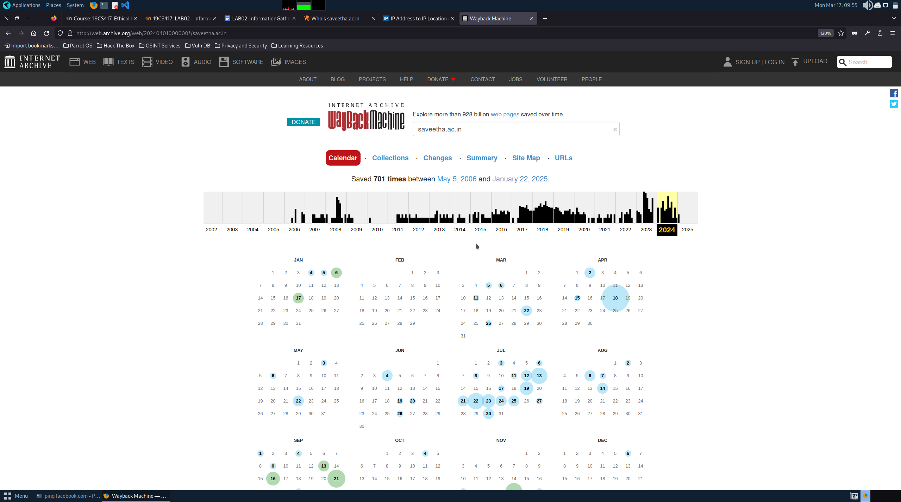
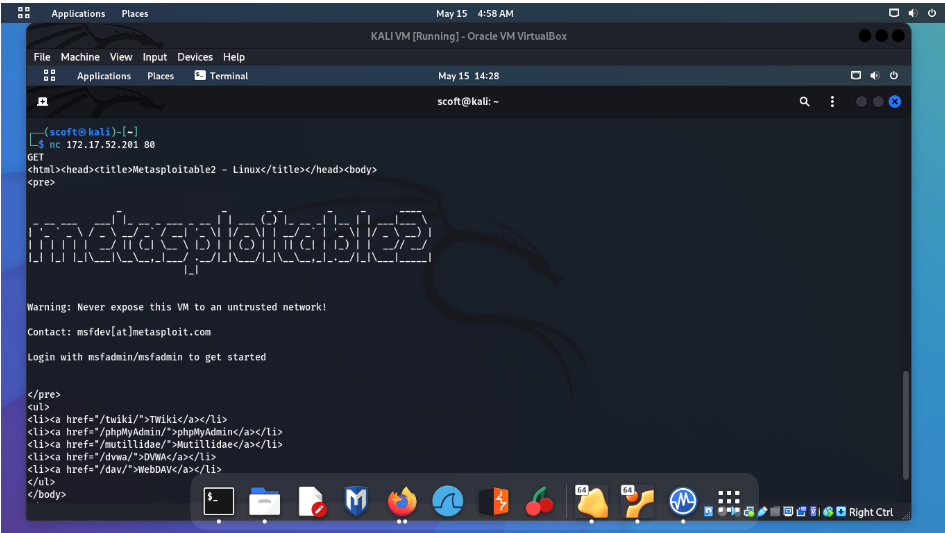
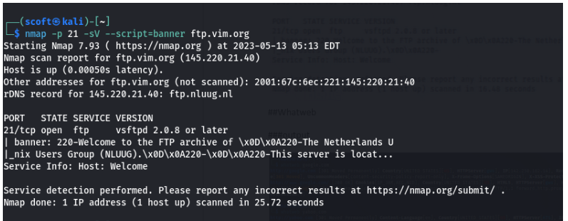
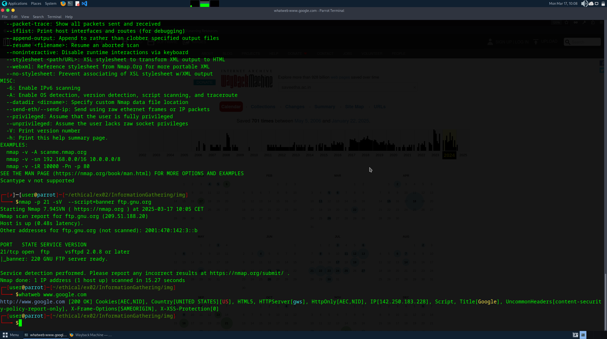
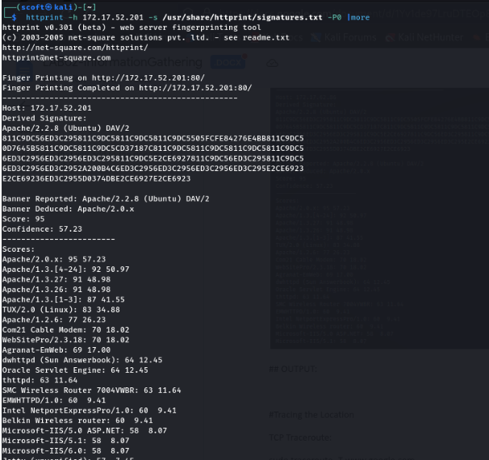
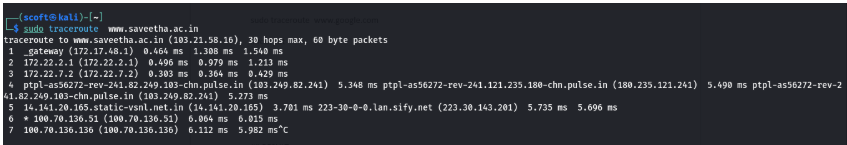

# InformationGathering
Information Gathering Techiques

# To perform information gathering techniques

# AIM:

To perform information gathering techniques using kali linux 

## STEPS:

### Step 1:

Install kali linux either in partition or virtual box or in live mode

### Step 2:

Investigate on the various categories of tools as follows:

### Step 3:
Open terminal/browser and try execute necessary commands/use url to perform information gathering

### Pen Test Tools Categories:

Following Categories of pen test tools are identified for information gathering:

Footprinting is a part of the reconnaissance process which is used for gathering possible information about a target computer system or network. http://www.whois.com/whois website to get detailed information about a domain name information including its owner, its registrar, date of registration, expiry, name server, owner's contact information, etc.

## OUTPUT:

### Whois:

### ip2location :

### web.archive.org :

## Webserver Finger Printing:
### Netcat:

### nmap :

### whatweb :

### httpprint :

## Tracing the Location
### TCP Traceroute: 

### UDP Traceroute:

### ICMP Traceroute:

## RESULT:
The information gathering techniques tools/procedure were  identified successfully
